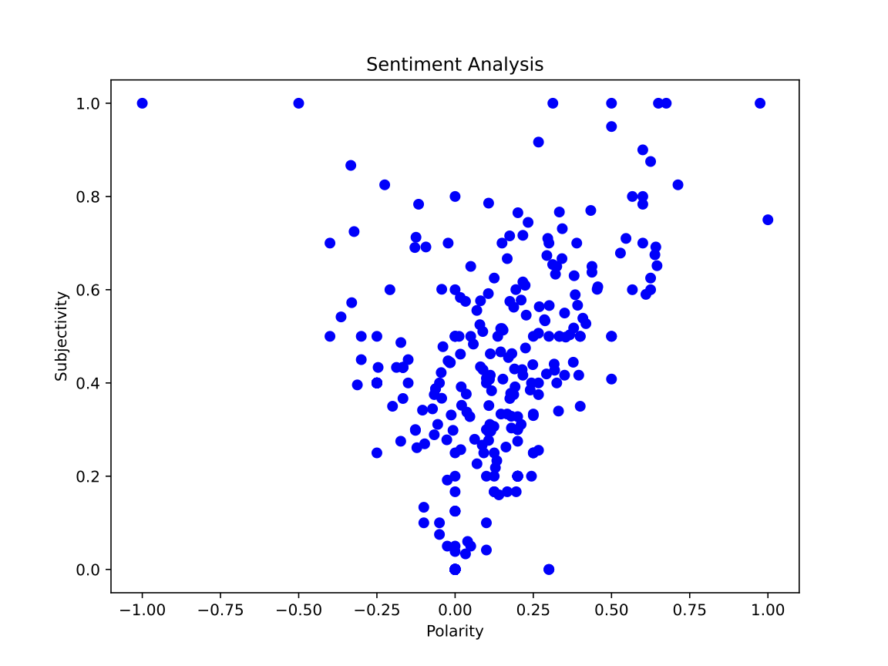
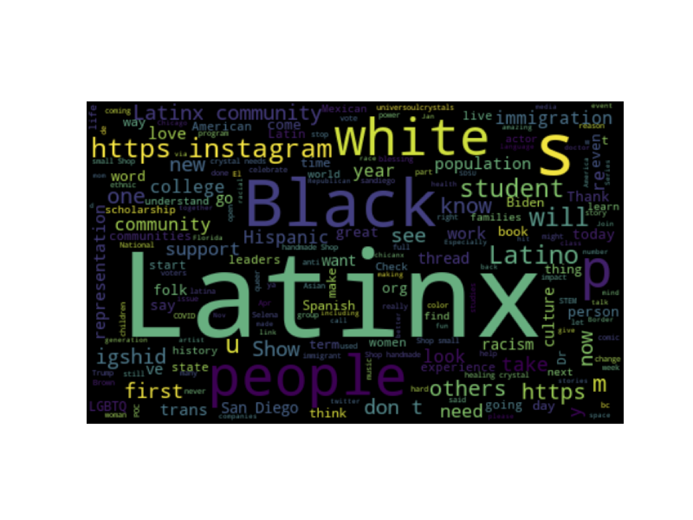

# README
This was a university project for the Python module.

# Twitssa

Twitssa is a <b>Twit</b>ter <b>S</b>crapper <b>S</b>entiment <b>A</b>nalysis app that searches a given word on Twitter and gives an in depth sentiment analysis.

Twitssa allows users to search for specific public tweets, scrape them off Twitter and clean the extracted tweets to use them sentiment analysis.

<br>


<br>

## Getting Started
Twitssa requires Python 3 installed as well as the chrome webdriver - the latter can be easily downloaded from the [Chrome website](https://chromedriver.chromium.org/downloads). The app is written in Python using [mini-forge](https://conda-forge.org/) via Homebrew and the main packages used are Selenium for scraping, Pandas for manipulating data and Tkinter for creating the GUI. This app was developed using an Apple laptop with the M1 chip and some Python libraries are simply not available using the Conda package manager. Please note, the provided YAML file installs libraries using both Conda and Pip.

<br>

To use Twitssa follow the next steps in the terminal:

<br>

* Create a new directory and clone the GitHub repository:

```bash
mkdir twitssa && cd twitssa && git clone https://github.com/jjcfrank/twitter-sentiment-analysis.git
```

* Install the needed libraries by updating the environment. The code below creates a new Conda environment **(recommeded**).

```bash
conda env update -n [name_environment] --file environment.yaml
```

* If you prefer to install the libraries in the base environment.

```bash
conda env update -n base --file environment.yaml
```

* Activate the Conda environment

```bash
conda activate [name_environment]
```
* Launch Twitssa
```bash
python3 twitssa.py
```

<br>

## Expected Output
After executing the app Twitssa should:
<ol>
<li>Display several descriptive statistics based on the used word</li>
<br>

<br>
<br>
<li>Create in the root directory a scatter plot graph with the sentiment polarity and subjectivity from the scraped tweets</li>
<br>

<br>
<br>
<li>Create in the root directory a bar plot graph with the number of positive, negative and neutral tweets</li>
<br>

<br>
<br>
<li>Create in the root directory a word cloud image with the most used words from the scraped tweets</li>
<br>

<br>
<br>
</ol>

<br>

## License & copyright

© Frank Jimenez

Licensed under the [MIT Licence](LICENSE).
