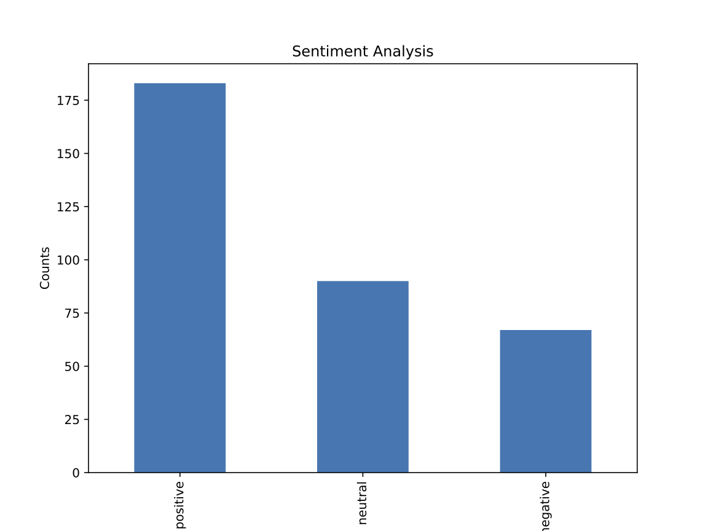

# Twitssa

Twitssa is a <b>Twit</b>ter <b>S</b>crapper <b>S</b>entiment <b>A</b>nalysis app that searches a given word on Twitter and gives an in depth sentiment analysis.

Twitssa allows users to search for specific public tweets, scrape them off Twitter and clean the extracted tweets to use them sentiment analysis.

<br>


<br>

* [Getting Started](#getting-started)
* [Methods](#methods)
* [Troubleshooting](#troubleshooting)
* [References](#references)

<br>

## Getting Started
Twitssa requires Python 3 installed as well as the chrome webdriver - the latter can be easily downloaded from the [Chrome website](https://chromedriver.chromium.org/downloads). The app is written in Python using [mini-forge](https://conda-forge.org/) via Homebrew and the main packages used are Selenium for scraping, Pandas for manipulating data and Tkinter for creating the GUI. This app was developed using an Apple laptop with the M1 chip and some Python libraries are simply not available using the Conda package manager. Please note, the provided YAML file installs libraries using both Conda and Pip.

<br>

To use Twitssa follow the next steps in the terminal:

<br>

* Create a new directory and clone the GitHub repository:

```bash
mkdir twitssa && cd twitssa && git clone https://github.com/jjcfrank/twitter-sentiment-analysis.git
```

* Install the needed libraries by updating the environment. The code below creates a new Conda environment **(recommeded**).

```bash
conda env update -n [name_environment] --file environment.yaml
```

* If you prefer to install the libraries in the base environment.

```bash
conda env update -n base --file environment.yaml
```

* Activate the Conda environment

```bash
conda activate [name_environment]
```
* Launch Twitssa
```bash
python3 twitssa.py
```

<br>

## Methods
Twitssa has four main components: the web scrapper, a text transformer to prepare the data, the sentiment analysis and the Graphical User Interphase (GUI).

A web scrapper such as Selenium - the one used in Twitssa - can programmatically parse and extract data from a given website due to its ability to understand HTML syntax. Twitssa, for example, scrapes <b><u>all</b></u> public tweets when given a word, a language and a location. In this particular case, [Twitter has its own API](https://developer.twitter.com/en/docs/twitter-api/v1/rate-limits#:~:text=Standard%20API%20v1.&text=You%20can%20only%20post%20300,id%20endpoint%20during%20that%20period.) to extract tweets but there are several limitations such as the amount of data that can be extracted which can be an issue for certain users. Web scraping gives users full control users to obtain vast amounts of data very quickly. As Mitchell (2018) describes it, <cite>"If the only way you access the internet is through a browser, you’re missing out on a huge range of possibilities."</cite>

After the data has been scraped, the content must be transformed to be used for further analysis. The scraped data is stored in a [Pandas](https://pandas.pydata.org/) DataFrame and goes through a text cleaning process to remove unnecessary references, symbols and punctuation marks. This is a vital stage as the sentiment analysis library will give erroneous predictions if the data is not formatted correctly.

Once all text has been transformed, [TextBlob](https://textblob.readthedocs.io/en/dev/) - the sentiment analysis library - begins analysing the data. Using weighted scoring the subjectivity and polarity of a text, a library such as TextBlob can be configured to read data and give predictions on whether the content is either positive, negative or neutral (Agarwal et all, 2011). Because of the sheer amount of data that can be scraped with Twitssa, a sentiment analysis library gives users the ability to programmatically classify text in a very small amount of time. 

Lastly, the Twitssa app contains code located at the end of the script that creates a Graphical User Interface using Python's default GUI Tkinter. The original script did not contain such graphical platform and had instead a terminal-style user input but a GUI was later added to create a more user-friendly environment for users.

<br>

## Expected Output
After executing the app Twitssa should:
<ol>
<li>Display several descriptive statistics based on the used word</li>
<br>

<br>
<br>
<li>Create in the root directory a scatter plot graph with the sentiment polarity and subjectivity from the scrapped tweets</li>
<br>

<br>
<br>
<li>Create in the root directory a bar plot graph with the number of positive, negative and neutral tweets</li>
<br>

<br>
<br>
<li>Create in the root directory a word cloud image with the most used words from the scrapped tweets</li>
<br>

<br>
<br>
</ol>

<br>

## Troubleshooting

Symptoms | Possible Solutions
--------- | ------------------
Cannot install environment.yaml | Make sure you have activated conda
PermissionError: [Errno 13] Permission denied | Make sure the chrome webdriver is inside the app folder

<br>

## References

["Rate limits: Standard v1.1"](https://developer.twitter.com/en/docs/twitter-api/v1/rate-limits#:~:text=Standard%20API%20v1.&text=You%20can%20only%20post%20300,id%20endpoint%20during%20that%20period.), Twitter, viewed 30 April 2021.

Mitchell, R., 2018. Web scraping with Python: Collecting more data from the modern web. " O'Reilly Media, Inc.".

Agarwal, A., Xie, B., Vovsha, I., Rambow, O. and Passonneau, R.J., 2011, June. Sentiment analysis of twitter data. In Proceedings of the workshop on language in social media (LSM 2011) (pp. 30-38).

<br>

## License & copyright

© Frank Jimenez

Licensed under the [MIT Licence](LICENSE).